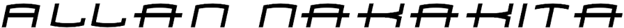

Olá, sou Allan Nakakita, desenvolvedor Python e entusiasta em *Machine Learning*, formado como bacharel em Sistemas de Informação na FMU - Faculdades Metropolitanas Unidas. Atualmente assistente de *M.I.S.* na ML Gomes, onde sou encarregado de desenvolver projetos em *Python* voltados para *Data Science* e automação.
